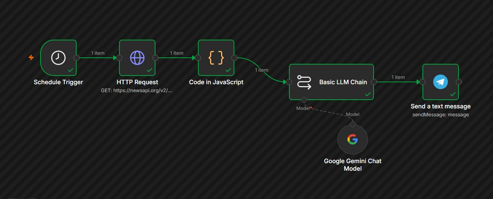
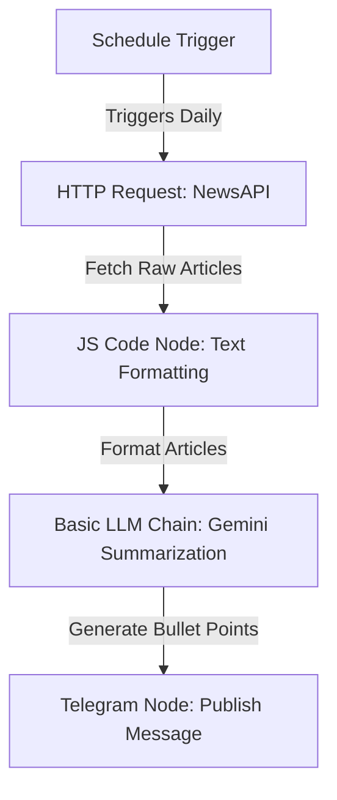
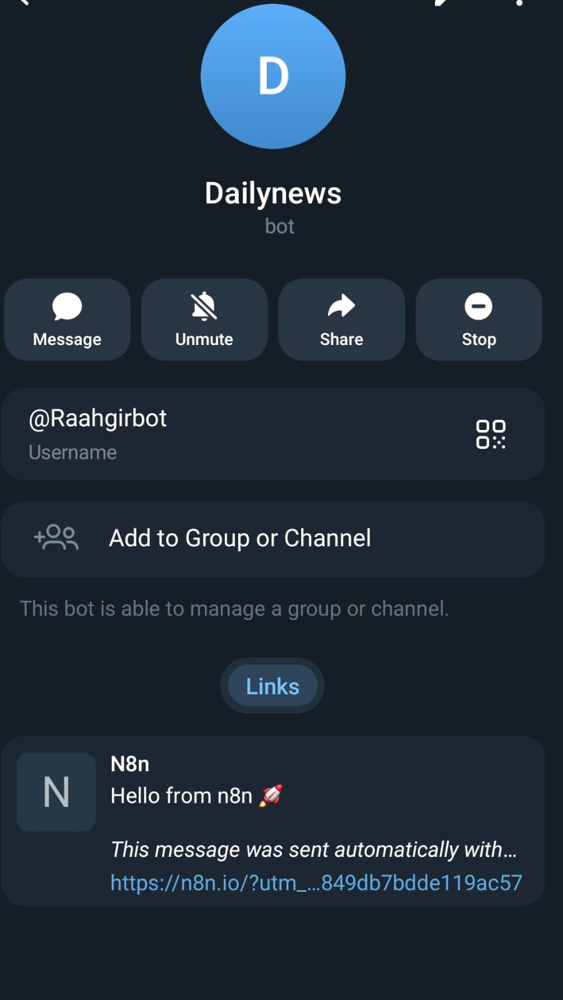

# 📰 DailyNewsAI - Automated AI News Summarizer & Telegram Publisher

Welcome to **DailyNewsAI**, a lightweight, self-hosted automation workflow that fetches the latest Artificial Intelligence news, uses advanced AI to summarize it, and publishes a daily digest directly to a Telegram channel.

Built using **n8n**, this project illustrates how to connect external APIs, run JavaScript transformation code, leverage large language models (LLMs), and integrate with messaging platforms.

---

## 🚀 How it Works

The workflow operates in 5 simple, automated steps:





1. **Schedule Trigger**: Runs automatically at a set interval (e.g., daily at 8:00 AM).
2. **HTTP Request**: Performs a GET request to the **NewsAPI** to fetch the top 5 trending articles about "Artificial Intelligence".
3. **JS Code Transformation**: Standardizes, cleans, and extracts key fields (Title, Source, Description, Date, URL) from the raw API response.
4. **AI Summarization (Gemini)**: Uses an LLM chain powered by **Google Gemini** to summarize the news into exactly 5 concise, high-impact bullet points with emojis.
5. **Telegram Publisher**: Automatically sends the finalized summary to your target Telegram chat or channel.

   

---

## 🛠️ Technology Stack Breakdown

This project utilizes several foundational modern web and DevOps technologies:

### 1. n8n (Workflow Automation)
[n8n](https://n8n.io/) is a powerful, fair-code, node-based workflow automation tool. Unlike traditional tools like Zapier, n8n is highly extensible, can be self-hosted, and supports advanced logic, JavaScript, and custom integrations (including LangChain for AI).
* **Self-Hosting**: You can host it yourself on your own server or computer, giving you complete data privacy.
* **Nodes**: Each card in the workflow represents a "Node" with a specific function (triggers, integrations, or helpers).

### 2. REST APIs (Representational State Transfer)
A **REST API** is a standard way for different web applications to talk to one another over HTTP. In this workflow, we query the **NewsAPI** endpoint:
* **Endpoint**: `https://newsapi.org/v2/everything`
* **Query Parameters**:
  * `q=Artificial+Intelligence`: Search term.
  * `language=en`: English articles only.
  * `pageSize=5`: Limits the results to 5 articles.
  * `apiKey`: The authentication token used to verify our access to the service.

### 3. Docker (Containerization)
[Docker](https://www.docker.com/) package applications and their dependencies into standardized units called **Containers**. Running n8n in Docker ensures it behaves exactly the same on your local computer, a home server, or a cloud server.
* **Why Docker?** No need to manually install Node.js, databases, or libraries. One command sets up the entire n8n environment.

---

## ⚙️ Setup & Deployment Guide

### Step 1: Run n8n using Docker
If you don't have n8n running, the easiest way to launch it is using Docker. Run the following command in your terminal:

```bash
docker run -d --name n8n -p 5678:5678 -v n8n_data:/home/node/.n8n n8nio/n8n
```

* `-d`: Runs the container in the background (detached mode).
* `-p 5678:5678`: Maps port `5678` on your host machine to port `5678` in the container.
* `-v n8n_data:/home/node/.n8n`: Persists your workflows and settings in a Docker volume so they aren't lost when the container restarts.

Once running, open your browser and navigate to **`http://localhost:5678`**.

---

### Step 2: Import the Workflow
1. Download or copy the contents of [My workflow.json](./My%20workflow.json) from this repository.
2. Open your n8n workspace in the browser.
3. Click on the top-right menu (three dots) and select **Import from File**.
4. Upload `My workflow.json`.

---

### Step 3: Configure Your Credentials & API Keys
To get the workflow running, you will need to add three sets of credentials:

1. **NewsAPI Key**:
   * Sign up for a free developer key at [NewsAPI.org](https://newsapi.org/).
   * Update the `HTTP Request` node URL by replacing `YOUR_NEWSAPI_KEY` with your actual API key.

2. **Google Gemini API**:
   * Get a Gemini API Key from Google AI Studio.
   * In n8n, click on the **Google Gemini Chat Model** node and create a new credential using your Gemini API key.

3. **Telegram Bot**:
   * Create a new Telegram bot by messaging [@BotFather](https://t.me/botfather) on Telegram and follow the instructions to get an HTTP API Bot Token.
   * Add your bot to the Telegram group or channel where you want to post.
   * Make your bot an administrator in that group/channel so it has permission to send messages.
   * In n8n, configure the **Telegram** node credentials with your bot token.
   * Set the **Chat ID** field in the Telegram node to your group/channel ID (e.g., `-100xxxxxxxxx`).

---

## 📝 Customization Tips
* **Change the Topic**: Modify the `q` parameter in the **HTTP Request** node to fetch news about other topics (e.g., `q=SpaceX` or `q=Web3`).
* **Adjust AI Tone**: Edit the system prompt inside the **Basic LLM Chain** node to change the summary style, target word counts, or emojis.
* **Change the Schedule**: Edit the **Schedule Trigger** node to run hourly, weekly, or at any specific time of day.
